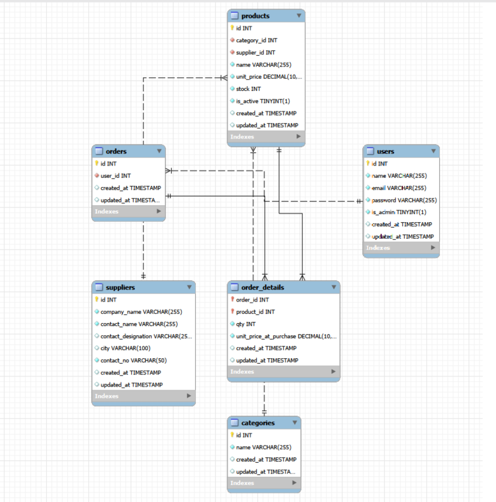

#P0 -> E-Commerce Console app

## TECH STACK

--**Python 3**
--**MySQL** -**MySQL Pyhton Connector** -**OOPS**

## ER Diagram

##Implemented

- User Registration And Login
- Admin Login
- Role Based Menus
- Password Hasing using bcrypt
- User Management
- Category Management
- Supplier Management
- Product Management
- Intermideatry Cart Class
- Order details and History
- Pagination for user product view
- Foreign Key Constraints

## Foreing Key Constraints

- \*\*product -> categories :RESTRICT -> prevents deletion if linked products and on update cascades

- \*\*products -> suppliers : RESTRICTS supplier deletion if linked, cacades on update.

- \*\*orders -> users : Restricts user deleteion if linked to products

- \*\*order_details -> orders -> If order deleted, order deltail items are deleted too.

- \*\*order_details -> products : Prevents product deletion of linked to order_details. Have made an isActive flag, instead of deleting products, as we might still want to not show them to users in some cases.

### Case Not Handled Yet

- Phone number validation
- Email Validation
- Partial Updates scenarious -> currently either sets it to null or raise error for not null constraints
- and more..
